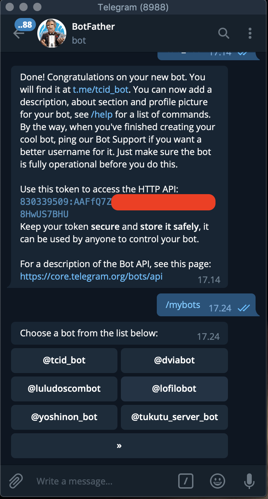

# BAB III
## Metode Penelitian
### 3.1. Instrument Penelitian
Penyusunan suatu proyek penelitian, sesuai dengan data-data permasalahan pokok yang dihadapi. Data dapat dikatakan baik apabila data tersebut dapat mewakili objek yang sedang diteliti dan untuk mendapatkan data yang baik diperlukan metode atau serangkaian cara yang sesuai dengan kebutuhan penelitian. Dalam penyusunan sistem penyesuaian infrastruktur dengan data-data dari objek penelirian yang dipakai. Data dikatakan baik apabila data tersebut dapat mewakili object dari yang sedang diteliti dan untuk mendapatkan data yang baik diperlukan metode atau serangkaian cara sesuai dengan kebutuhan peneliti.

### 3.2. Prosedur Pengambilan Data
Untuk mendapatkan data yang benar, akurat dan relevan serta sesuai dengan sumber data dan tujuan penyusunan Laporan Kuliah Kerja Industri ini, maka peneliti dalam pengumpulan data menggunakan beberapa teknik antara lain adalah sebagai berikut :

#### 3.2.1. Observasi
Teknik pengumpulan data dengan cara melakukan pengamatan yang terlibat langsung pada infrastruktur server Tukutu, dalam sistem pengembangan Bot Telegram serta pemilahan bahasa pemrograman yang tepat dan efisien dalam Tim Pengembangan Bot Telegram Tukutu yang berada dibawah pengawasan PT Dinustek. Observasi dilakukan untuk melihat potensi Bot untuk penyesuaian penggunaan pada sistem Continuous Integration dan Delivery, Dengan mengumpulkan apa saja yang berhubungan dengan server, service, bot serta environment yang tersedia. 

#### 3.2.2. Studi Literatur
Melakukan berbagai pencarian terhadap teori-teori dan literatur yang dapat digunakan sebagai dasar melakukan penelitian. Serta mempelajari penelitian yang pernah dilakukan sebelumnya sehingga dapat lebih memahami teori yang ada.

#### 3.2.3. Forum Diskusi & Tutorial
Teknik pengumpulan data dengan cara membuat sebuah forum diskusi, yang berisikan para pengembang sistem. Peneliti membuka diskusi pada group chat tim pengembang aplikasi Tukutu, guna mengetahui masalah yang sebenarnya dialami oleh  tim pengembang. Secara rutin melakukan pertemuan dengan pengembang aplikas Tukutu untuk mendiskusikan bagaimana cara membuat Aplikasi Tukutu bisa melakukan rolling update dengan memanfaatakn Telegram Bot sebagai integrasi sistem dan metode deployment. 

### 3.3. Teknik Analisis Data
Data yang diperoleh dari literatur, forum diskusi dan Observasi akan diolah sesuai dengan bagian – bagian dari sistem Bot. Dari hasil analisa yang didapatkan akan dilakukan analisa masalah dengan pengembangan fitur yang cocok sebagai solusi dari masalah tersebut, sehingga diharapkan fitur baru yang dibuat akan mampu menyelesaikan masalah yang ada dan berfungsi dengan baik, serta untuk melakukan perbaikan jika terdapat suatu bug/error.

### 3.4. Metode
Dalam proses mengembangkan Bot Telegram Tukutu ini tim pengembang menggunakan metode RAD (Rapid Application Development) dengan mempersiapkan skenario test case sebelum membuat fungsional code. Berikut ini merupakan tahapan - tahapan yang akan dilakukan dalam penerapan metode RAD:

#### 3.4.1. Rapid Application Development (RAD)
Berdasarkan model RAD diatas dapat diuraikan pembahasan masing - masing tahapan sebagai berikut:
- Requirement Planing

Pada tahap ini pengembang melakukan observasi untuk perancangan pada kebutuhan sistem perangkat lunak atau Bot dan untuk menggambarkan area-area dimana definisi lebih jauh untuk iterasi selanjutnya. 
- User Design
Pada tahan User Design pengembang harus dapat menentukan rancangan secara detail dari spesifikasi, fitur, serta alur program dengan jelas, sehingga pada tahap selanjutnya dapat langsung dilakukan implementasi program. Terdapat beberapa sub-modul pada poin ini, yaitu:

1. Prototyping
Pengembang menciptakan beberapa versi pada program untuk dilakukan pengujian program mana yang akan lebih baik untuk digunakan dan dikembangkan kedepannya.

2. Testing
Setiap prototype yang sudah dibuat akan dilakukan pengetesan secara manual oleh pengembang dan juga beberapa user.

3. Refine
Prototype yang telah dilakukan pengetesan akan di saring akan di kembangkan menjadi prototype baru, serta untuk prototype yang lulus dalam proses penyaringan akan dilakukan pengembangan lebih lanjut.

- Construction
Pada tahapan ini pengembang akan membangun sistem dengan para pengguna secara intensif dengan melakukan testing dan merangcang aspek - aspek bisnis dan non teknis perusahaan. Apabila sudah ditemukan aspek aspek yang telah disetujui maka sistem akan segera di bangun dan disaring, sistem - sistem baru atau bagian dari sistem di ujicoba lalu kemudian diperkenalkan kepada pengguna.

- Cutover
Ini adalah tahap implementasi di mana produk jadi diluncurkan. Ini mencakup konversi data, pengujian, dan penggantian ke sistem baru, serta pelatihan pengguna. Semua perubahan akhir dilakukan saat pengembang dan pengguna terus mencari bug di sistem.

#### 3.4.1. Perancangan Sistem Bot
Perancangan Sistem merupakan tahapan awal yang harus dilakukan pada proses RAD ketika mengerjakan sebuah fitur, spesifikasi, deskripsi dan juga detail kebutuhan serta hasil yang diinginkan harus jelas dalam implementasi. Pada Bot Telegram Tukutu akan terdapat beberapa fitur/perintah Bot utama yaitu:

- converting text-to-script : bot mampu melakukan konversi dari pesan yang dikirim oleh user kemudian mentranslasi kan pesan tersebut menjadi sebuah command-line pada server.
- filtering user : bot dapat melakukan pengecekan pada user yang mengirim sebuah pesan, jika user tidak terdaftar pada environment Bot Telegram Tukutu maka bot akan menolak akses dan akan mengirim log pada super User yang telah di definisikan CHAT_ID nya pada environment.
- self update : pembaruan Sistem Bot Telegram lewat bot itu sendiri
- healt check : pengecekan bot apakah dia posisi shutdown/running, jika bot terjadi sebuah kesalahan/bug/error akan ada pengechekan setiap 1 jam yang akan melakukan restart Bot Telegram Secara otomatis, apabila bot tidak terjadi apa - apa maka log akan tertulis dengan keterangan proses Bot Telegram masih berjalan
- log service : Bot Telegram akan mengecek log dengan memanfaatkan git, dan akan mengurim history commit 10 baris terakhir dari repository yang ada di remote server.
- update service : yang meliputi alur melakukan pembaruan pada service yang ada pada server produksi/development dengan meliputi sebuah script bash sebagai otomasi.

Berdasarkan data fitur-fitur tersebut akan dibuat suatu skenario pengujian dengan ketentuan bahwa setiap sub-fitur akan dibuatkan setidaknya dua kondisi pengujian yaitu kondisi pengujian positif dan negatif. Dua kondisi ini diperlukan agar dapat dipastikan bahwa fungsi yang dibuat dapan menangani ketika seluruh parameter yang diperlukan benar dan dapat mengantisipasi jika parameter yang dikirim ada yang salah.

#### 3.4.2. Pembuatan Akun Telegram Bot
Telegram Bot merupakan sebuah fitur yang ada pada Aplikasi Telegram yang dapat kita manfaatkan secara gratis, pembuatan Bot Telegram dapat diklakukan pada Aplikasi Telegram. Untuk membangun sistem untuk Bot yang terintegrasi dengan Telegram kita membutuhkan sebuah TELEGRAM BOT TOKEN, yang kita bisa dapatkan dengan membuat bot secara gratis pada Telegram BotFather (@@BotFather).

Untuk mendapatkan TELEGRAM BOT TOKEN Langkah pertama yaitu membuat bot dengan perintah /newbot pada BotFather, kemudian BotFather akan menanyakan nama yang akan ditampilan pada Bot, sebagai sample peneliti mengisinya dengan nama TUKUTU CI/CD, jika sudah BotFather akan menanyakan lagi username untuk Bot tersebut, karena ini username maka apabila terjadi pengambilan username yang sudah di gunakan BotFather akan memberitahu jika username tersebut sudah di gunakan dan juga ketentuan username pada bot sekarang harus memiliki sebuah kata yang mengandung kata bot. Sebagai Contoh terdapat pada gambar dibawah

Dari gambar diatas pengembang sudah membuat Telegram Bot dan mendapatkan sebuah TELEGRAM BOT TOKEN untuk mengakses Telegram Bot API. BotFather menyediakan fitur untuk manajemen Bot, pengembang bisa menggunakan perintah /mybots untuk mengetahui Bot apa saja yang sudah dibuat. 

Untuk mengatur Bot yang telah dibuat, pengembang dapat menekan username Bot yang tersedia.

#### 3.4.3. Pendefinisian Telegram Bot Token
Untuk dapat menggunakan service Telegram Bot API diperlukan sebuah Telegram Bot Token, setiap Bot memiliki Token yang unik, token didefinsikan pada sebuah file .env atau file yang berisi nilai environment - environment yang bersifat dynamic atau berubah - ubah. 

Untuk bahasa yang digunakan pada gambar diatas adalah NodeJS, 